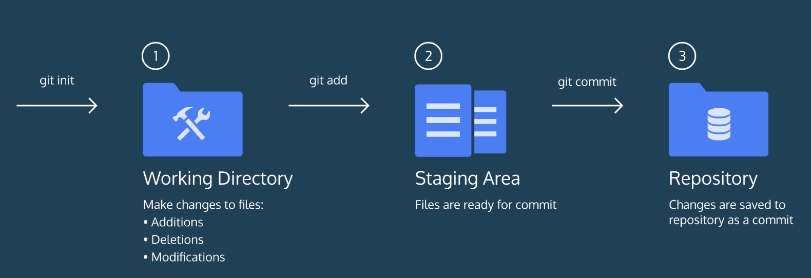
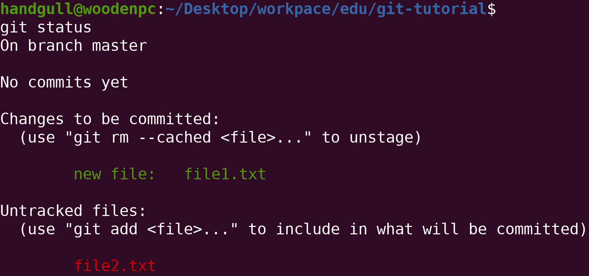
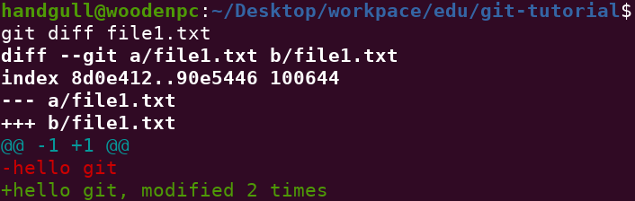
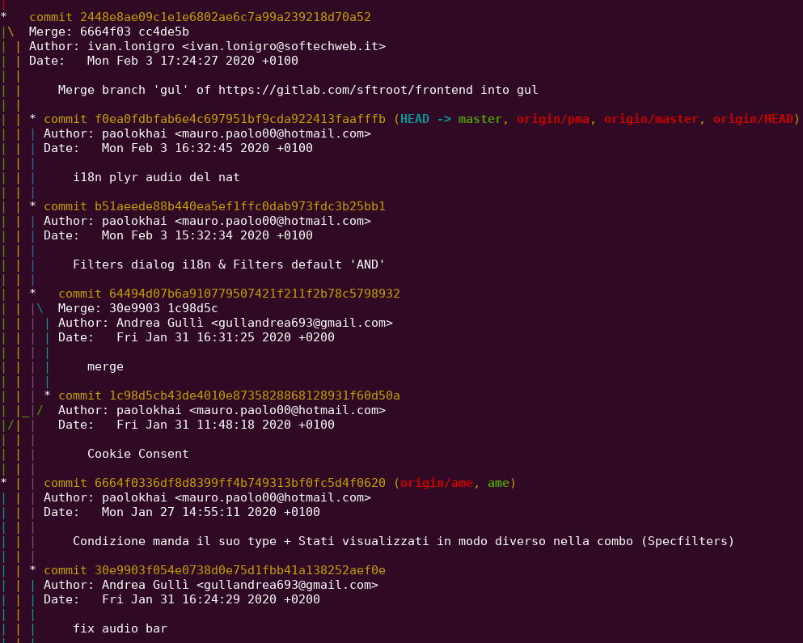

# Hello Git: Workflow di base

Git è un software che permette di **tenere traccia** dei cambiamenti fatti su un progetto nel tempo. Git ricorda ogni modifica, tenendone traccia e dando la possibilità di **accedere ad ogni versione** salvata del progetto.

## i 3 stadi di un progetto git

Possiamo semplificare (di molto) il workflow di git dividendolo in 3 parti:
1. Effettuo delle modifiche al progetto (aggiunta/rimozione/modifica di files).
2. **Staging Area**: bisogna aggiungere le modifiche alla lista di modifiche pronte per essere "committate"
3. Salvo i cambiamenti in una **commit**, le commit vengono conservate nella **Git repository**


```sh
$ git init # init = initialize, inizializza tutti gli strumenti necessari al versioning (nella cartella .git)
$ git status # Visualizza lo stato del branch
$ git add <filename> # Aggiunge le modifiche relative al file alla staging area sopra citata
$ git add -A # Aggiunge tutte le modifiche pendenti alla staging area
$ git commit -m"<comment>" # Salva permanentemente come commit le modifiche
$ git commit --amend -m"<comment>" # Sovrascrive l'ultima commit effettuata, utile per mantenere la history pulita e chiara in caso di piccole sviste
```

:::tip
**Convenzioni riguardanti i commenti**:<br>
- Dovrebbero essere in [Present Tense](https://learnenglish.britishcouncil.org/english-grammar-reference/present-tense)
- Non dovrebbero superare i **50 caratteri**
:::



:::tip
I files in verde sono gli **staged files**, quelli rossi sono quelli in attesa di essere aggiunti alla staging area
:::

## git diff

Git ci permette di vedere le **differenze** tra i files della working directory e la staging area (molti editor/IDE supportano Git e forniscono uno strumento grafico per vedere questo, naturalmente essi si appoggiano al comando fornito da git).
```sh
$ git diff <filename> # Visualizza la lista dei cambiamenti di un file rispetto alla staging area
```



## git log

Le commit possono essere viste grazie ad uno **storico** (come vedremo, lo storico può essere sia locale che remoto)

