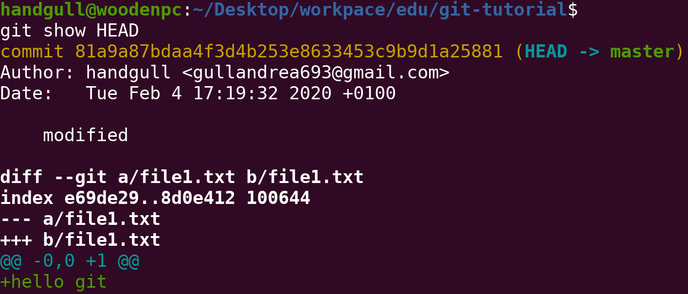
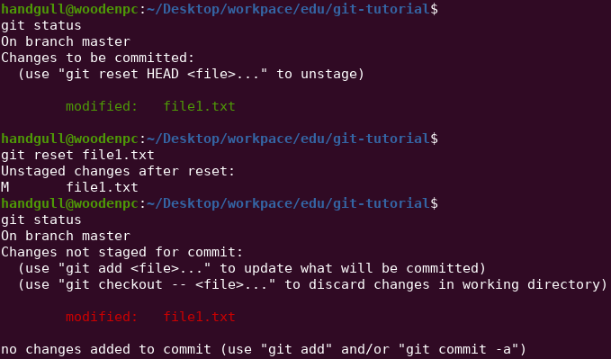

# Backtracking: ritornare sui propri passi

## git show e head commit

`HEAD` identifica la commit in cui si è attualmente (spesso coincide con l'ultima commit dello storico, ma non è detto)
```sh
$ git show HEAD # Stampa i dati relativi alla commit in cui si è (dati dello storico + dati modifiche effettuate)
$ git show <hash> # Stampa i dati relativi alla commit identificata dall'hash
```
> In un certo senso `git show` è come un `git log` SOLO di una commit + `git diff`



## git checkout
```sh{2}
$ git checkout HEAD <filename> # Riporta il file allo stato in cui era all'ultma commit, se non specificato HEAD è impostato di default
# git checkout HEAD <filename> == git checkout <filename>
$ git checkout <hash> <filename> # Riporta il file allo stato in cui era nella commit specificata
$ git checkout <hash> # Porta la HEAD alla commit specificata, riportando tutti i file allo stato che erano in quella commit, ma mantenendo nello storico i cambiamenti effettuati dopo.
# Utile se si vuole ad esempio creare un nuovo branch partendo da una commit passata
```

## git reset
```sh
$ git reset <filename> # Toglie il file dalla staging area (img 1)
$ git reset <SHA> # Riporta i file e la HEAD alla commit specificata, eliminando dallo storico tutte le commit dopo la commit specificata (img 2)
# NOTA: i cambiamenti non sono persi, ma semplicemente "diventano rossi" ovvero in attesa di essere annullati o aggiunti alla staging area
```
:::tip
Qui (come in tutti i comandi visti fin ora per riferirsi ad una commit bastano i **primi 7 caratteri** dell'hash)
:::



