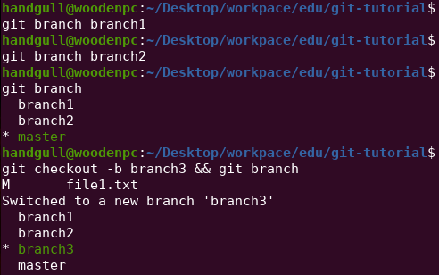
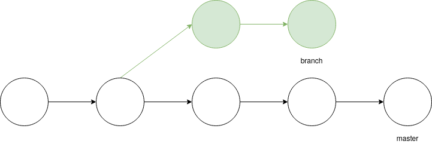
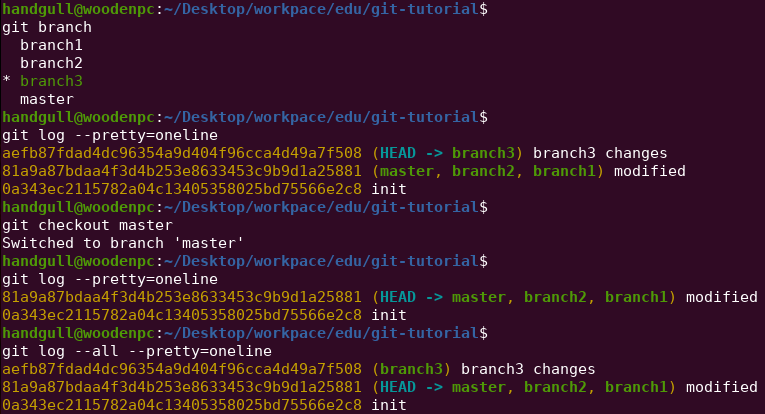
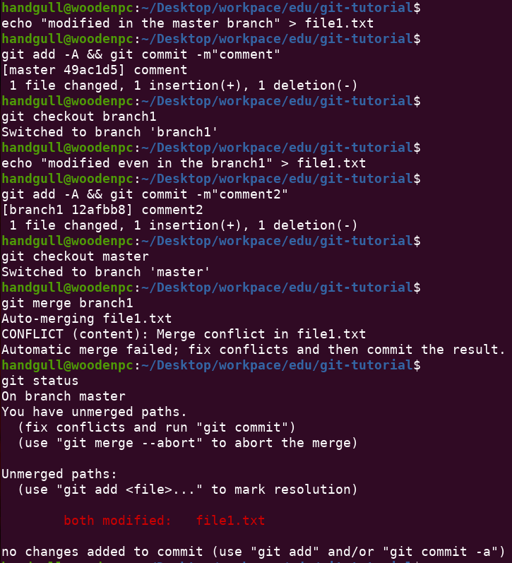

# Branching
Fin ora abbiamo sempre lavorato nel **branch** creato automaticamente con la `init` di un progetto git, ovvero `master`.<br>
Git ci permette di creare infiniti branch, in questo modo è possibile avere infinite versioni del progetto che **coesistono** allo stesso momento, le modifiche apportate dai vari branch possono essere allineate tramite una **merge**.<br>
Spesso i branch sono utilizzati per aggiungere nuove **feature** e per far lavorare in **parallelo** più sviluppatori.
> Analogia: [Forcola scout](https://it.scoutwiki.org/Forcola])
```sh
$ git branch # Lista dei branch, che evidenzia il branch attivo
$ git branch <branch> # Crea un nuovo branch, che parte dalla HEAD
$ git checkout -b <branch> # Crea un nuovo branch, che parte dalla HEAD e cambia il branch attivo in quello appena creato
$ git checkout <branch> # Cambia il branch attivo
```





## Parentesi riguardo git log

> Sei arrivato qui tramite link? continua leggere da [qui](../backtracking#branching)

Come si vede nell'immagine qui sotto `git log` di default mostra solo lo storico delle commit **relative al branch** attivo, è però possibile stampare a video lo storico di tutte le commit utilizzando il flag `--all`.



## git merge
:::tip
Quando possibile appoggiarsi sempre ad una soluzione grafica per i merge, in modo da gestire con più facilità i possibili **conflitti**.
:::
```sh
$ git merge <branch> # Effettua il merge del branch specificato all'interno del branch corrente
$ git branch -d <branch> # Cancella il branch (se non è il branch corrente) SE E SOLO SE quel branch è già stato mergiato
$ git branch -D <branch> # Cancella il branch (se non è il branch corrente) in ogni caso
> Se il branch corrente è semplicemente più indietro di qualche commit il risultato della merge sarà un **fast forward**

## Merge conflict

