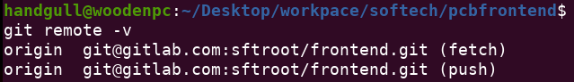

# Teamwork: come collaborare
Per collaborare serve che ogni sviluppatore abbia:
- Una replica del codice sul suo computer
- Un modo per tenere traccia delle modifiche sul suo computer
- Accesso alla versione definitiva del progetto

Tutto questo può essere ottenuto utilizzando i `remotes`.<br>
Un **remote** è una **shared Git repository**, ovvero messa su di un **server** git.

:::warning
Nella home tra gli approfondimenti vi sono molti link utili, tra cui uno sulle **best practices** per la gestione dei branch.
:::

## git clone
```sh{2}
git clone <remote_path> <name> # Clona un progetto (clonandone anche i remote) ed assegna il nuovo nome alla cartella
# NOTA: se non si specifica il nome esso sarà uguale al nome della repository remota
```

## git remote
```sh{2}
git remote -v # Stampa a video la lista dei remotes, ovvero le varie repository remote collegate al progetto
git remote add <name> <remote_path> # Aggiunge un remote alla cartella (il 99% delle volte name = origin)
git remote remove <name> # Rimuove il remote specificato dalla repository
```
> Il nome di default, ed usato per convenzione, della cartella remota principale è `origin`.<br>
Se si vuole il nome può essere anche cambiato.



:::tip
Come si vede sopra origin è specificato 2 volte, una per le **fetch** ed una per le **push**.<br>
Vedremo più avanti il significato preciso di queste azioni, il concetto base da sapere è che fetch indica la **lettura** e push la **scrittura**
:::

## git fetch & git pull
Se mentre stiamo lavorando un altro sviluppatore pusha delle commit sulla repository remota ci serve fare una `git fetch` per avere accesso a quei cambiamenti.<br>
La fetch non aggiorna il branch, ma semplicemente controlla lo stato del branch remoto corrispondente al nostro branch.<br>

Per recuperare le modifiche remote si possono usare 2 metodi equivalenti:
```sh
# Metodo 1: non mi serve una fetch esplicita, è implicita nella pull:
git pull # La prima volta va specificato il branch remoto da associare al nostro branch (es. git pull origin master)
# Metodo 2: mi serve una fetch esplicita
git fetch
git merge <origin_name>/<branch>
```

## git push
La push serve per mandare le commit locali sul branch corrispondente della repository remota
```sh
# Metodo 1: non mi serve una fetch esplicita, è implicita nella pull:
git push <remote_name> <branch> # Dopo la prima volta non serve più specificare remote e branch remoto
git push --force # Azione pericolosa ma a volte utile... sovrascrive il branch remoto fregandosene della situazione
```
